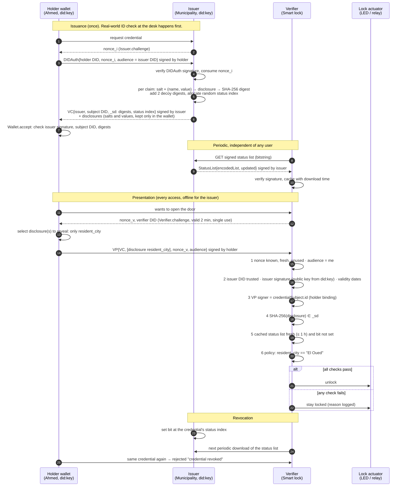

# Credential exchange — sequence diagram

Rendered automatically by GitHub / VS Code (Mermaid). Message names match the code in
`part_b/ssi/roles.py`.

```mermaid
sequenceDiagram
    autonumber
    participant H as Holder wallet<br/>(Ahmed, did:key)
    participant I as Issuer<br/>(Municipality, did:key)
    participant V as Verifier<br/>(Smart lock)
    participant L as Lock actuator<br/>(LED / relay)

    Note over H,I: Issuance (once). Real-world ID check at the desk happens first.
    H->>I: request credential
    I-->>H: nonce_i  (Issuer.challenge)
    H->>I: DIDAuth{holder DID, nonce_i, audience = issuer DID} signed by holder
    I->>I: verify DIDAuth signature, consume nonce_i
    I->>I: per claim: salt + (name, value) → disclosure → SHA-256 digest<br/>add 2 decoy digests, allocate random status index
    I-->>H: VC{issuer, subject DID, _sd: digests, status index} signed by issuer<br/>+ disclosures (salts and values, kept only in the wallet)
    H->>H: Wallet.accept: check issuer signature, subject DID, digests

    Note over I,V: Periodic, independent of any user
    V->>I: GET signed status list (bitstring)
    I-->>V: StatusList{encodedList, updated} signed by issuer
    V->>V: verify signature, cache with download time

    Note over H,V: Presentation (every access, offline for the issuer)
    H->>V: wants to open the door
    V-->>H: nonce_v, verifier DID  (Verifier.challenge, valid 2 min, single use)
    H->>H: select disclosure(s) to reveal: only resident_city
    H->>V: VP{VC, [disclosure resident_city], nonce_v, audience} signed by holder
    V->>V: 1 nonce known, fresh, unused · audience = me
    V->>V: 2 issuer DID trusted · issuer signature (public key from did:key) · validity dates
    V->>V: 3 VP signer = credentialSubject.id (holder binding)
    V->>V: 4 SHA-256(disclosure) ∈ _sd
    V->>V: 5 cached status list fresh (≤ 1 h) and bit not set
    V->>V: 6 policy: resident_city == "El Oued"
    alt all checks pass
        V->>L: unlock
    else any check fails
        V->>L: stay locked (reason logged)
    end

    Note over I,V: Revocation
    I->>I: set bit at the credential's status index
    V->>I: next periodic download of the status list
    H->>V: same credential again → rejected "credential revoked"
```
